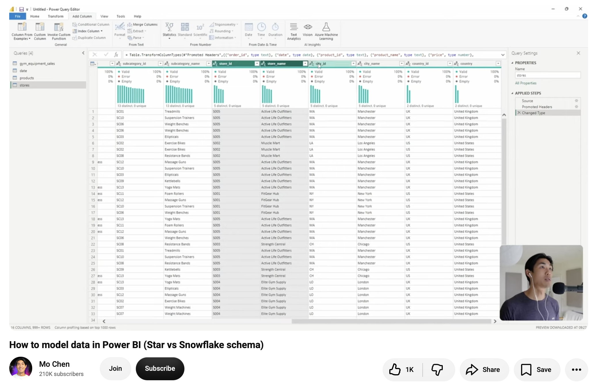
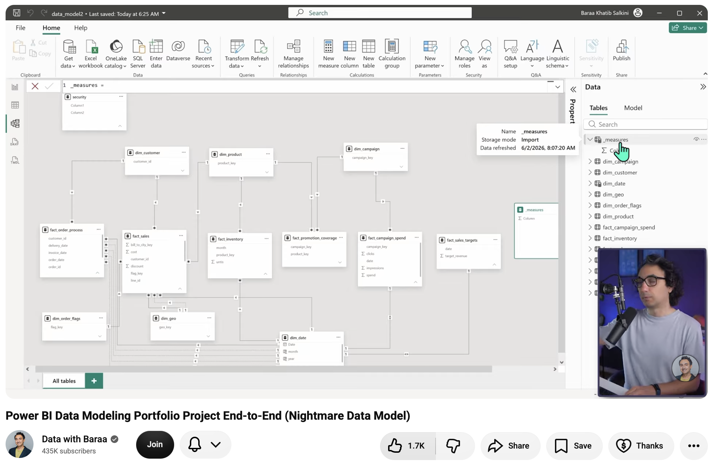
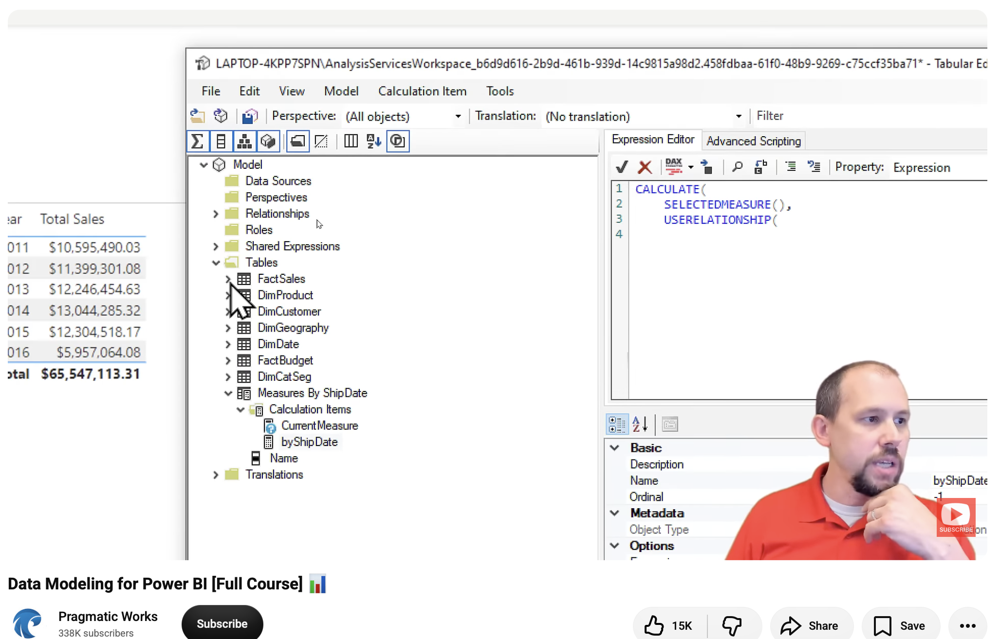
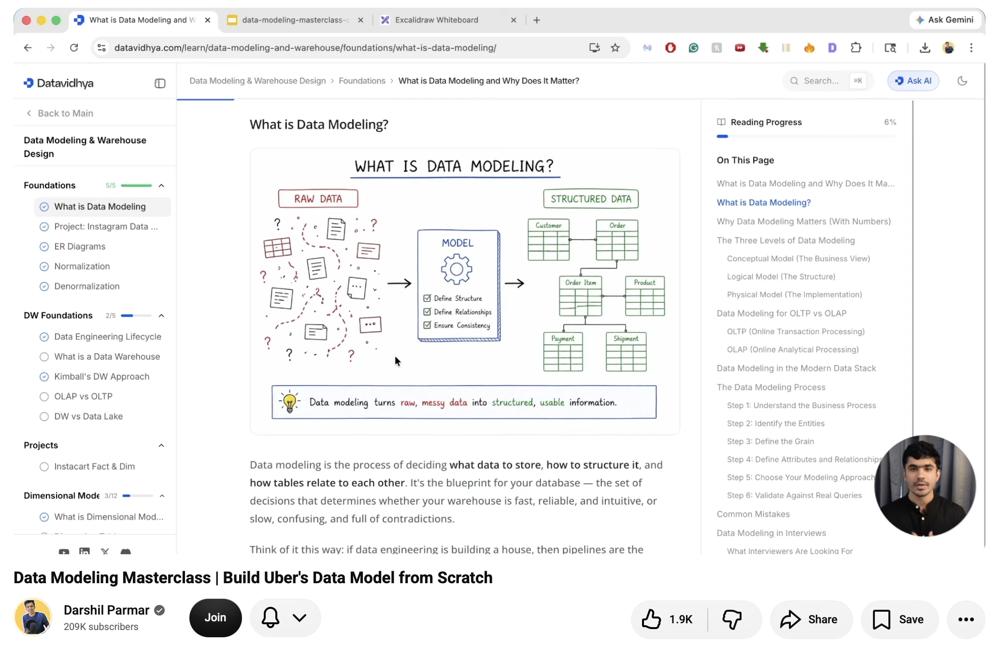
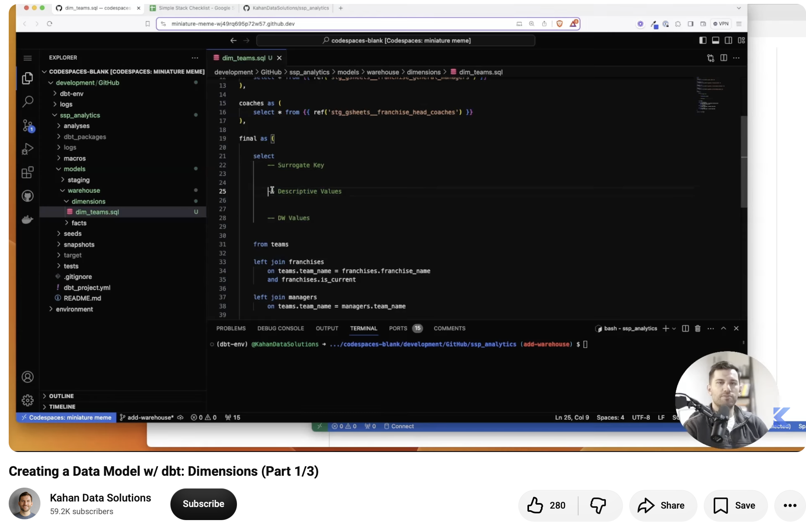

# Data Modelling — Curated Video Playlist

A short, focused path through data modelling — from the fundamentals to a deeper practical dive. Watch them in order for the best learning curve.

## 🎬 Watch in this order

### 1. Start Here
The foundational video — build your base understanding of data modelling concepts before moving on.

🔗 https://www.youtube.com/watch?v=e984cS23nrk

### 2. Deep Dive
Once you've got the basics down, this goes further into the details and reasoning behind good data models.

🔗 https://www.youtube.com/watch?v=0A2k62YEbfI

### 3. Applied Concepts
Builds on the previous videos with more applied examples. (Starts at the 40:06 mark.)

🔗 https://www.youtube.com/watch?v=MrLnibFTtbA&t=2406s

### 4. Continuing the Journey
Keeps expanding your data modelling toolkit with DBT

🔗 https://www.youtube.com/watch?v=RmugzY84iL4

### 5. Wrapping It Up
Rounds out the series, tying the concepts together.

🔗 https://www.youtube.com/watch?v=p-j-dcmOOqs

---

💡 **Tip:** Bookmark this list and work through it in one sitting or spread across a few days — each video builds on the last.

Found this useful? Follow along for more curated learning paths like this one!

